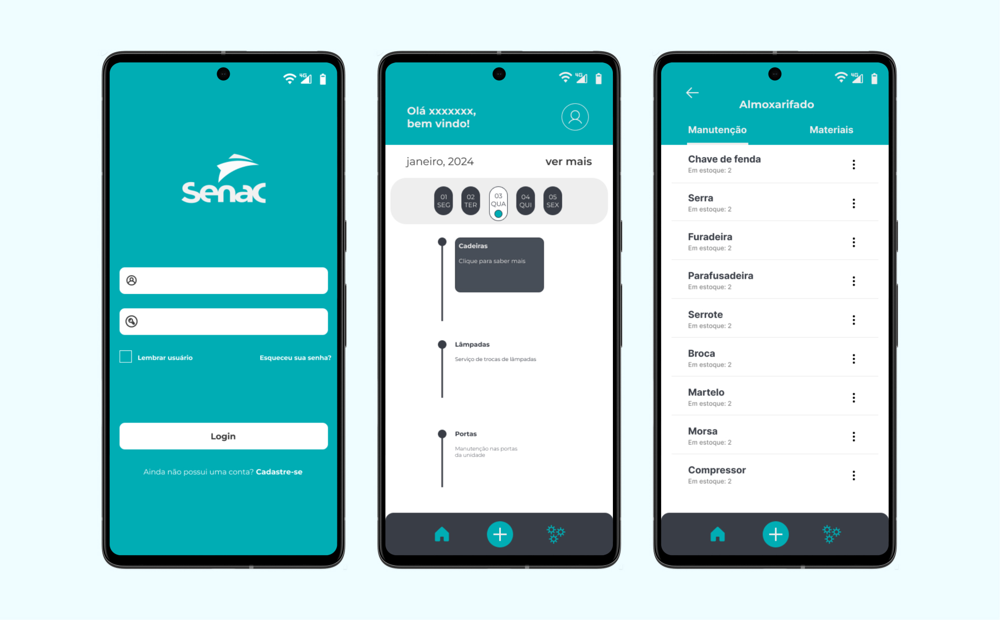

# Sistema de Almoxarifado


Este é um aplicativo mobile para gerenciamento de almoxarifado, permitindo a criação de tarefa, controle de estoque e gerenciamento eficiente de materiais, feito para o
Projeto Integrador de Mobile do SENAC (2023 - Ainda não finalizado).

## Recursos principais
- Cadastro de usuário
## Disclaimer
- Login
- Criação de tarefas
- Edição de produtos em estoque

## Tecnologias Utilizadas
- React Native
- Node.js

## Pré-requisitos
Antes de começar, certifique-se de ter instalado as seguintes ferramentas:
- Node.js
- npm ou Yarn
- Um dispositivo móvel ou emulador para testar o aplicativo
  
## Instalação
1. Clone este repositório:
   
```
git clone https://github.com/AndreiFernando/almox2
```

## Instale as dependências:
```
npm install @react-navigation/native @react-navigation/native-stack
```
```
npm install @expo/vector-icons
```
```
npm install react-native-numeric-input
```
```
npm install react-native-numeric-inpu
```

## Colaboradores

Agradecemos às seguintes pessoas que contribuíram para este projeto:

<table>
  <tr>
    <td align="center">
      <a href="https://github.com/AndreiFernando">
        <br>
        <sub>
          <b>Andrei Fernando</b>
        </sub>
      </a>
    </td>
    <td align="center">
      <a href="https://github.com/AndreAssun">
        <br>
        <sub>
          <b>André Assunção/b>
        </sub>
      </a>
    </td>
    <td align="center">
      <a href="https://github.com/edvxndxvi">
        <br>
        <sub>
          <b>Edvan Davi</b>
        </sub>
      </a>
    </td>
  </tr>
</table>

